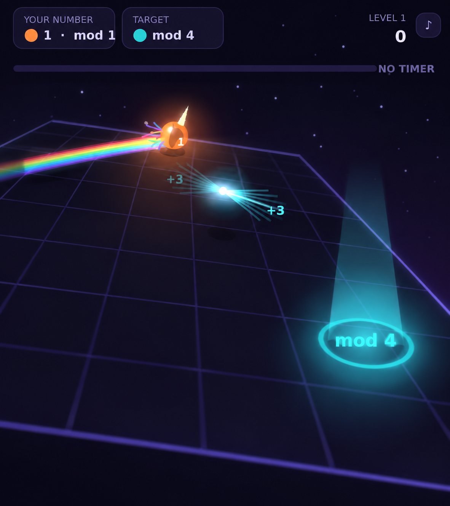
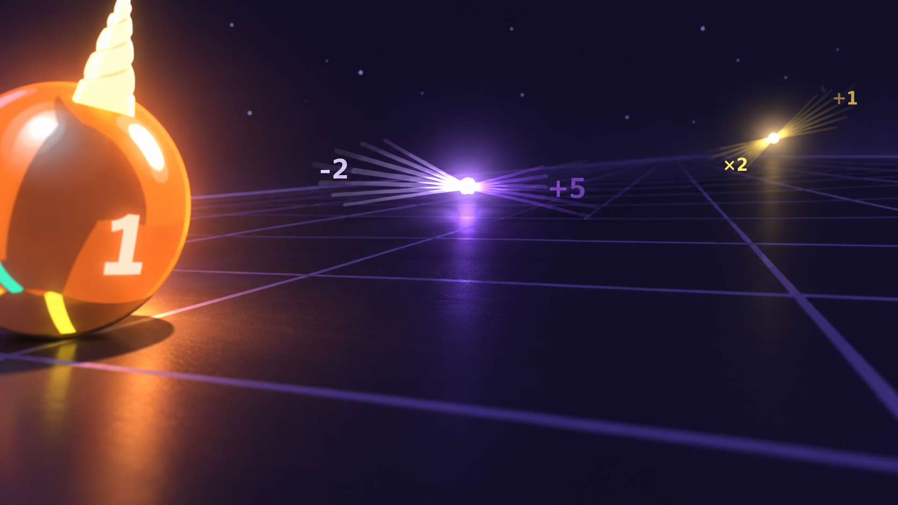
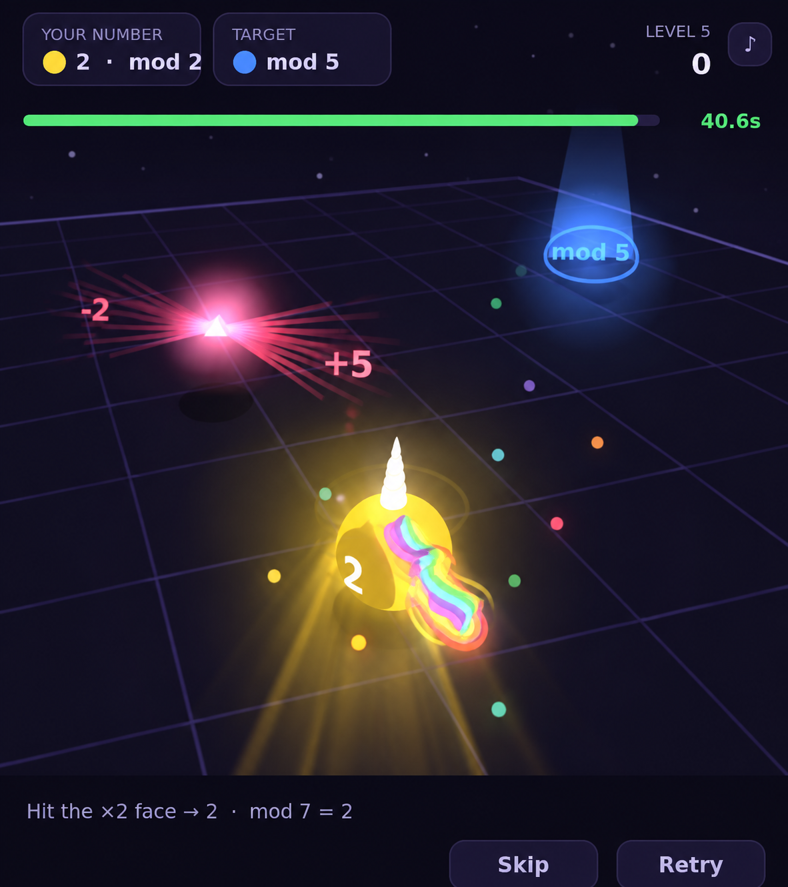

**Your number is your colour.**

You are a unicorn made of light, rolling across a slab in the dark. Take your
number mod 7 — that remainder is the colour you glow. Reach the light column
glowing its colour and the level opens.

To change your number you roll into prisms. A prism has two faces, and which
operator you get depends on the side you hit it from: clip it from the left and
it might add 5; come at the same prism from the right and it multiplies by 2.

**You don't have to do the arithmetic in your head.** The light each prism
scatters is the answer: every beam is drawn in the colour you would become if
you hit that face. A beam outlined in white means that face wins the level. A
grey beam means it would take you negative, and your light goes out. Work the
numbers out if that's the fun part, or just read the colours and pick a route.

So a level is a route, not a sum. Order matters (+3 then ×2 is not ×2 then +3),
approach angle matters, and momentum makes both harder than they look. Prisms
come back a few seconds after you take one, so a mistake costs time, not the
run.

The first five levels are hand-built and each introduces exactly one idea — the
first two have no timer at all. After that levels are generated, always from a
solution path laid down before the decoys are scattered, so an unsolvable level
can't happen.

## Controls

**Desktop:** drag anywhere to tilt the board, or use the arrow keys.

**Mobile:** tilt the phone itself. Whatever posture you're holding when it
starts counts as level; the ⌖ button re-centres it any time. Dragging still
works and overrides tilt.

## Play in VR

Requires a WebXR headset with a tracked controller. The board becomes a real
slab floating in front of you — the 2D canvas is only used for the small
floating panel above it.

- **Tilt the board:** push the thumbstick, or tilt a controller like you're
  holding the slab. Hold both controllers and it tips with the height
  difference between your hands.
- **Confirm:** trigger, for Start and Next level.
- **Re-centre:** grip button. Resets your neutral hand posture and moves the
  board back in front of you.

## Technical notes

One canvas, drawn entirely in code — no images, no fonts, no libraries, no
external requests. The non-VR 3D isn't WebGL: it's a hand-rolled perspective
projection, so tilting the board is just a per-vertex height, and depth
sorting, the coloured light the unicorn casts on the floor and the seven-band
rainbow trail all fall out of the same few hundred bytes. VR is a separate raw
WebGL scene with real geometry and per-eye matrices.

Audio is synthesised at runtime. Each pickup is pitched by your new remainder
against a major scale, so the sound carries the colour too — and every colour
in the game is mirrored in text, so it's playable without relying on hue at
all.
